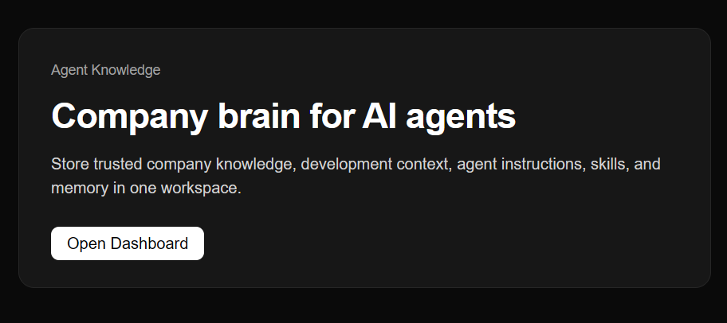
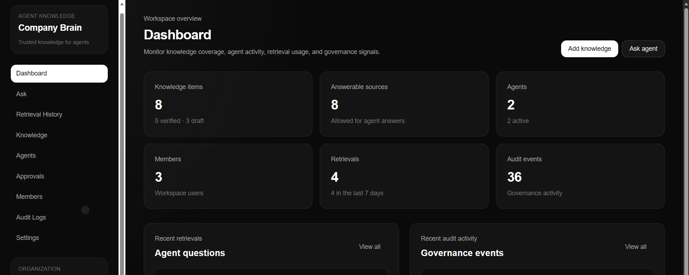

# Agent Knowledge Management System

A full-stack knowledge management system for storing, organizing, and managing project/agent information.

## Overview

Agent Knowledge Management System is a web-based application built to help users manage knowledge records in an organized way. It allows users to create, edit, search, and manage information through a clean and responsive interface.

## Features

- Create, edit, and manage knowledge records
- Organize project/agent information
- Search and filter knowledge records
- Responsive frontend interface
- Backend/database setup using Convex
- Modern project structure using Turborepo

## Tech Stack

- React
- Next.js
- Convex
- Turborepo
- JavaScript
- GitHub
- VS Code

## Screenshots

### Home Page


### Dashboard


## Getting Started

### 1. Clone the repository

```bash
git clone https://github.com/umairasfar01/agent-knowledge.git
